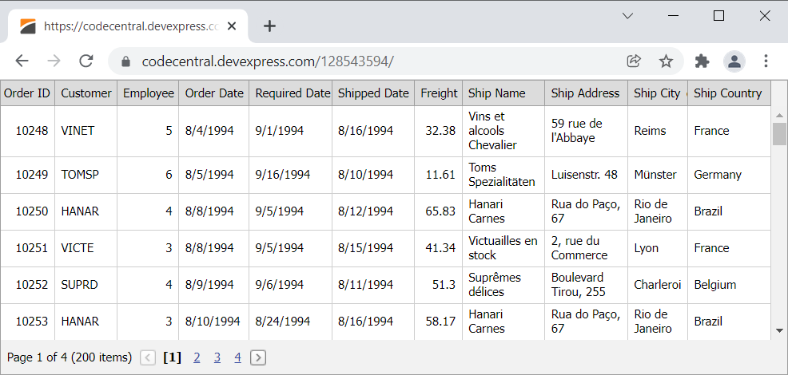

<!-- default badges list -->

[](https://supportcenter.devexpress.com/ticket/details/E1081)
[](https://docs.devexpress.com/GeneralInformation/403183)
<!-- default badges end -->
# Grid View for ASP.NET Web Forms - How to display the Grid View in the full screen mode (100% width and height)

This example demonstrates how to set the size of the [Grid View](https://docs.devexpress.com/AspNet/5823/components/grid-view) control to the size of the browser window.



## Overview

Follow the steps below to display the [ASPxGridView](https://docs.devexpress.com/AspNet/DevExpress.Web.ASPxGridView) control in the full screen mode.

### 1. Remove Margins

Set the `body` element's paddings and margins to zero.

```css  
body, html  {
    padding: 0;  
    margin: 0;  
}  
``` 

### 2. Add a Vertical Scroll Bar

Set the [VerticalScrollBarMode](https://docs.devexpress.com/AspNet/DevExpress.Web.ASPxGridSettings.VerticalScrollBarMode) property to `Visible` to show the vertical scrollbar.

```aspx
<dx:ASPxGridView runat="server" ID="gridView" ClientInstanceName="grid" Width="100%" DataSourceID="ds" KeyFieldName="OrderID">
    <SettingsPager PageSize="50" />
    <Settings VerticalScrollBarMode="Visible" VerticalScrollableHeight="0" />
</dx:ASPxGridView>
```

### 3. Set the Control's Height

Handle the [Init](https://docs.microsoft.com/en-us/dotnet/api/system.web.ui.control.init?view=netframework-4.8) and [EndCallback](https://docs.devexpress.com/AspNet/js-ASPxClientGridView.EndCallback) events and call the [SetHeight](https://docs.devexpress.com/AspNet/js-ASPxClientControl.SetHeight(height)) method to adjust the Grid View's height during initialization and after each [callback](https://docs.devexpress.com/AspNet/402559/common-concepts/callbacks).

```aspx
function OnInit(s, e) {
    AdjustSize();
}
function OnEndCallback(s, e) {
    AdjustSize();
}
function AdjustSize() {
    var height = Math.max(0, document.documentElement.clientHeight);
    grid.SetHeight(height);
}

<dx:ASPxGridView runat="server" ID="gridView" ClientInstanceName="grid" Width="100%" DataSourceID="ds" KeyFieldName="OrderID">
    <!-- ... --->
    <ClientSideEvents Init="OnInit" EndCallback="OnEndCallback" />
</dx:ASPxGridView>
```

### 4. Hide the Resizing from Users

Place the [ASPxGridView](https://docs.devexpress.com/AspNet/DevExpress.Web.ASPxGridView) in a hidden container and show the container after initialization is completed.

```aspx
function OnInit(s, e) {
    // ...
    document.getElementById("gridContainer").style.visibility = "";
}

<div id="gridContainer" style="visibility: hidden">
    <dx:ASPxGridView runat="server" ID="gridView" ClientInstanceName="grid" Width="100%" DataSourceID="ds" KeyFieldName="OrderID">
        <!-- ... --->
    </dx:ASPxGridView>
</div>
```

<!-- default file list -->

## Files to Look At

* [Default.aspx](./CS/Default.aspx) (VB: [Default.aspx](./VB/Default.aspx))
* [Default.aspx.cs](./CS/Default.aspx.cs) (VB: [Default.aspx.vb](./VB/Default.aspx.vb))

<!-- default file list end -->

## Documentation

- [Grid View Examples](https://docs.devexpress.com/AspNet/3768/components/grid-view/examples)

## More Examples

- [Grid View for ASP.NET MVC - How to display the Grid View in the full screen mode](https://supportcenter.devexpress.com/ticket/details/t830635/how-to-use-the-gridview-extension-in-full-screen-mode-100-browser-width-and-height)
- [Page Control for ASP.NET Web Forms - How to display the Page Control in the full screen mode](https://supportcenter.devexpress.com/ticket/details/t830634/how-to-use-the-aspxpagecontrol-control-in-full-screen-mode-100-browser-width-and-height)
